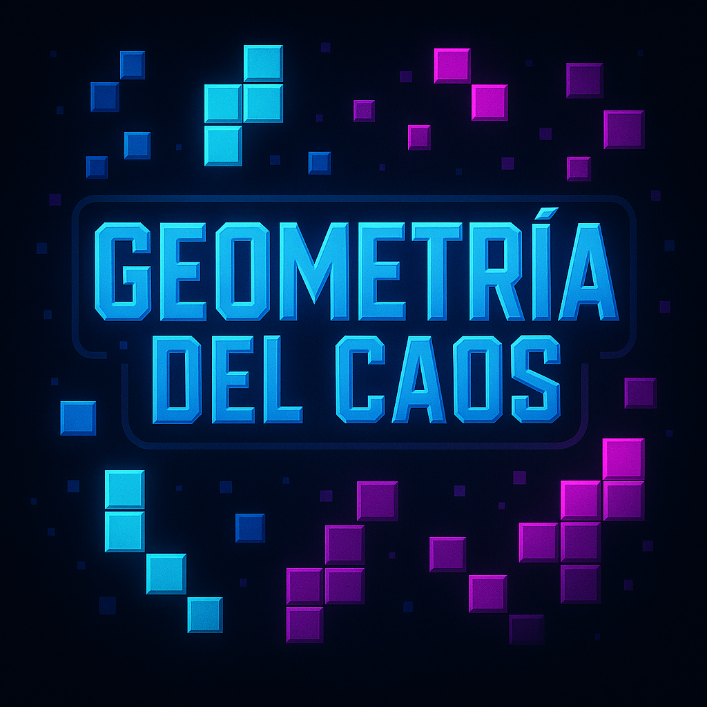

### Hey, We are Joel and Victor! 

 
   

Welcome to our Unity videogame final project workspace called Geometria del Caos!  
Here we are going to share all our current work and also the assets that we are using 🚀

⚠️ **Important Note:** 

⚠️ **Important Note:** I upload here my portfolio with all the information like projects, personal information and more stuff.

[Mi Portfolio](https://victorcn2006.github.io/mi-portfolio/)
[Mi Portfolio](https://victorcn2006.github.io/mi-portfolio/)

---

### 📊 GitHub Stats

---

## 🧠 Programming Languages & Tools

---
