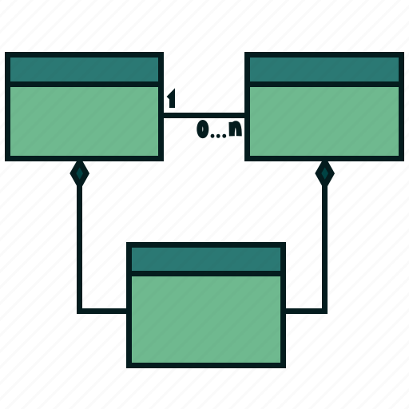

# UML GEOMETRY OF CHAOS

Here you are going to find three different types of UML, the first one which contains a basic UML that we design at first, sencondly the a Development UML and the last UML with all the classes and methods we used.
Above there are the three links, we used the platform LucidChart to create them.

[First UML](https://lucid.app/lucidchart/9c3d4325-9b29-4716-9b2e-c45c28014fd4/edit?viewport_loc=-1298%2C-1379%2C3323%2C1761%2C0_0&invitationId=inv_56354ade-ad84-4838-a934-fe1bddf9fc3c)

[Second UML](https://lucid.app/lucidspark/59897dc2-043d-41ef-a4a0-7586549ed8e0/edit?viewport_loc=-5872%2C-3320%2C4320%2C2295%2C0_0&invitationId=inv_877926fb-2032-44f0-84b0-c39b0b4f298c)

[Third UML](https://lucid.app/lucidchart/f09ad608-cbea-48bc-bacf-1957f86aa643/edit?viewport_loc=-293%2C-100%2C2226%2C1180%2CHWEp-vi-RSFO&invitationId=inv_fce94e7d-e7a9-4d3b-b912-c73130f072f8)

